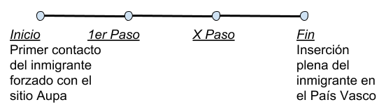

# Plano de estrategia

## Objetivos 

**Producto**

Es una plataforma web informativa denominada *Aupa "La plataforma que te ayuda"*, consiste en ordenar la información relevante de  instituciones publicas y ONGs que trabajan para integrar a los migrantes forzados por cuestiones políticas, económicas, guerras (...). Eventualmente, crearemos contenido que complemente lo anterior para cumplir los objetivos del producto. 

### Visión

Ser referentes número uno para todos los refugiados e inmigrantes forzados que llegan al País Vasco para que tengan una correcta inserción dentro de la comunidad.

__*¿Cómo veo mi producto?*__

Queremos que Aupa sea un sitio web donde los migrantes puedan encontrar información útil para la acogida en el País Vasco, además será una plataforma que les permita interactuar y contar sus experiencias al mismo tiempo que se van adaptando al entorno. 

__*¿Cómo quiero que sea el producto?*__

El producto está pensado como una línea de tiempo.

Nos referimos a una secuencia de pasos que tiene como punto de partida el momento en que los inmigrantes llegan al País Vasco, desde ahí, se da inicio a una serie de pasos que al ser completados, puedan lograr una plena inserción dentro de la comunidad.

__*¿Cuál es el propósito de mi producto?*__

Buscamos ser ese facilitador para los inmigrantes forzados que pueda brindarle un marco formal ó camino a seguir para resolver sus necesidades e inquietudes con el menor plazo de tiempo posible.
De un modo simplificado, partiremos dando por sentado una situación común a todos los inmigrantes forzados la que denominaremos "punto cero" con la siguiente característica: inmigrante forzado que llega al Pais Vasco sin tener resuelto de antemano los papeles migratorios, alojamiento, alimentación, educación, trabajo, atención sanitaria, red de vínculos sociales, etc. Desde allí, existirán "x pasos", que prevén, facilitar el camino a seguir para la resolución ó superación de todas las necesidades que tienen hasta alcanzar el paso final que les permita la plena inserción en la comunidad vasca.
Esta permitiria a los inmigrantes que quieren quedarse en el Pais Vasco de se integrar. Por ejemplo, buscar un trabajo, obtener la tarjeta de salud, buscar un alojamiento. 

__*¿Quiénes son los clientes potenciales asociados con mi producto?*__

El público al que nos dirigimos son migrantes entre 25 y 45 años que llegan al País Vasco. Nos hemos centrado en esta franja de edad porque según una encuesta realizada por el Gobierno Vasco en el año 2010 el 47% de los inmigrantes que llegan tienen entre 25 y 44 años, un 34% son menores de 25 años y tan solo el 19% son mayores de 45 años. Por esta razón, hemos concretado nuestro cliente potencial en este rango de edad, ya que además son las personas que más uso hacen de plataformas web, redes sociales y aplicaciones para móvil o tablets.En esta franja de edad las necesidades basicas son las mismas: salud, trabajo, alojamiento por ejemplo. 

__*¿Cómo puedo ganarme la confianza de estas personas por medio de mi producto?*__

Por medio de las alianzas estratégicas con las ONG´s y la certificación de ellas, ya que desde nuestro sitio web se generan hipervínculos directos a los sitios web de esas organizaciones acreditadas y de igual manera conseguir que esas organizaciones nos mencionen en sus sitios. Por otro lado, los documentos y trámites disponibles en el sitio web deberán cumplir con los siguientes requerimientos: ser verídicos, formales, claros y de sitios oficiales de las instituciones públicas del País Vasco y de reconocidas organizaciones no gubernamentales.

### Circunstancias de uso

__Quien__:

El público al que nos dirigimos son migrantes de entre 20 y 45 años que llegan al País Vasco. Nos hemos centrado en esta franja de edad, ya que según una encuesta realizada por el Gobierno Vasco en el año 2010 el 47% de los inmigrantes que llegan tienen entre 25 y 44 años, un 34% son menores de 25 años y tan solo el 19% son mayores de 45 años. Por esta razón, hemos concretado nuestro publico objetivo en este rango de edad, ya que además son las personas que más uso hacen de plataformas web, redes sociales y aplicaciones para móvil o tablets.

__Que__: 

La plataforma web de Aupa , informará a las personas migrantes que se encuentran en el País Vasco. Es una plataforma creada con el fin de que las personas afectadas encuentren ayudas administrativas, refugio, educación, alimentación, asistencia sanitaria o que puedan incorporarse a organizaciones que defiendan sus derechos, como ACNUR u otras ONGs.

__Cuando__: 

Desde el momento en que llegan al País Vasco para instalarse, debido a que la plataforma se centra en ayudar a acoplarse en la nueva cultura y también en la reubicación para que así puedan satisfacer sus necesidades básicas. 

__Dónde__: 

Pais Vasco. 

__Para que__: 

Facilitar la integración de los inmigrantes en la comunidad Vasca, brindarles esperanza y que puedan superar la crisis en la que se ven sumergidos.

### Criterios de diseño

Aupa tiene como fin comunicar e informar a los migrantes del País Vasco, por ende los criterios de diseño los definimos de la siguiente manera: 

* Accesibilidad: El sitio web está pensado para obtener acceso multipantalla, es decir, nuestros usuarios pueden ingresar al sitio web desde la computadora, la tablet o el teléfono móvil. 

* Findability:  En nuestro sitio web, la intuitividad es muy importante, las pestañas deben ser muy claras y con una organización fácil para los inmigrantes. 

* Funcionalidad: se refiere a que todo lo disponible en la web funcione correctamente. 

* Utilidad: hace referencia al uso que el usuario pueda dar a la web. Es decir, que la información y la manera de ordenarla sea correcta para cumplir con las necesidades del público objetivo.

* Estética: Esta cualidad busca una apariencia amigable para el usuario. La elección de la tipografía es un ejemplo de criterio influenciado por este factor. → Para nuestro sitio web, la simplicidad es un factor muy importante porque no todos nuestros usuarios dominan la lengua hispana, por esta razón no integraremos textos largos, a su vez, complementaremos con imágenes y multimedia para enriquecer nuestro sitio y ayudar a que se pueda encontrar de una manera más rápida lo que buscan. Es decir, el diseño de la plataforma está pensado en simplicidad desde las pestañas del menú hasta el contenido informativo.

* Intuitividad: Otro de los propósitos de la plataforma web es que el usuario pueda vivir una experiencia agradable y sin frustraciones, esto se logra mediante técnicas de navegación que sean claras, reduciendo la ambigüedad en la interpretación, es decir, si lo que busca es información sobre la documentación, encontrará una pestaña que diga “Trámite de documentos”, y que al clickear salga efectivamente la información sobre dónde debe ir, qué requisitos cumplimentar, las entidades a las cuales puede contactar. Un error que le genere frustración al usuario sería que al momento de clickear en la pestaña en lugar de encontrar esa información encuentre micro historias de las experiencias de otros migrantes en la ciudad.

* Credibilidad: La credibilidad en nuestro sitio se debe sostener en parte a partir del trabajo ético, transparente, moral y profesional de todos los que forman parte de este sitio web, la otra parte, vendrá dado gracias a las alianzas con instituciones del orden público y reconocidas ONGs. Presentaremos de manera visible, una sección dedicada a los Partners, que serán justamente estas instituciones y organizaciones con quienes trabajamos conjuntamente. Todo esto ayudará en el tiempo a fortalecer la confianza, fiabilidad y credibilidad en nuestro sitio web.

### Indicadores de éxito

* Happiness (Satisfacción de los usuarios en relación con el producto): Se quiere la satisfacción del usuario mediante una valoración que realizarán ellos mismos al momento de  abandonar la plataforma. Es decir un tipo de encuesta donde 1 es insatisfecho y 5 es muy satisfecho + un box de sugerencias.

* Engagement (Grado de respuesta del usuario sobre el producto): “Para medir el grado de recomendación que realizan los usuarios de nuestro sitio web podemos utilizar el criterio de clasificación denominado NPS (Net Promoter Score), para lo cual se clasifican en tres grupos: Los detractores serían aquellos con una puntuación de entre 0 y 6, los pasivos aquellos que nos otorguen entre un 7 y un 8 y los promotores serían aquellos que puntuaron entre un 9 y un 10 dicha sección de nuestra web”.→ Para nuestro sitio, podemos utilizar este criterio de clasificación para medir el grado de recomendación de unos inmigrantes a otros. Es muy interesante de utilizar este NPS para nuestro sitio porque podemos saber los sentimientos que tienen las personas por el sitio web.

* Adoption (El número de usuarios que se registra en un determinado espacio temporal): Es necesario establecer un objetivo de usuarios nuevos en el sitio web vinculado a un porcentaje (ejemplo 90%) de inmigrantes forzados nuevos que arriben al País Vasco mensualmente.

* Retention (El número de usuarios que utiliza un producto durante un determinado tiempo): Es posible que el usuario encuentre diversas dificultades en el sitio web, por esta razón se construyen indicadores como: 
Ratio de usuarios que han completado todas las tareas
Ratio de usuarios que han cometido algún error en alguna de las tareas
Cantidad media de errores cometidos por los usuarios durante las tareas realizadas
Tiempo estimado para la realización de cada tarea
Grado de dificultad encontrado para completar cada tarea

* Task success (Grado de satisfacción respecto a la consecución de las tareas que permite la web): Podemos cuestionar a los usuarios de nuestro sitio web para tener un mejor visión de cómo los usuarios vean nuestro sitio web. Es necesario de conocer la idea del usuario sobre nuestro sitio web.

## Necesidades del usuario
Segmentación de usuarios
Generales → Hombre y mujeres 20-45 años
Específico → Hombres y mujeres entre 20 y 45 años de clase media-baja, que provienen de centroamérica, norte de sudamérica y marruecos.

### Investigación de usuarios

<<<<<<< HEAD
=======
Entrevistas:
- Reflexione: ¿Qué complicaciones encontró desde su llegada en el País Vasco?
- Enumera cosas que le resulten importante lograr para sentir que ha alcanzado una plena inserción en el País Vasco.
- ¿Cree que una plataforma web puede ayudarle a lo largo del camino hasta alcanzar una mejor adaptación en el País Vasco?
- ¿Qué esperaría de un sitio web orientado a inmigrantes forzados para que sea útil?
- ¿Con qué frecuencia utiliza internet?
- ¿Por medio de que soporte tecnológico se conecta a internet? 
- ¿Con qué frecuencia consulta los portales de noticias de su país de origen?
>>>>>>> bd5e00734c89688984ade9a16fda2bc0afd55a82

### Personas

## Lean UX Canvas

(plantilla/modelo en el documento `lean-ux-canvas.md`)

## Referencias

* Abendaño, J. L., & Lafuente, A. (s.f.). Extranjeros en Euskadi: mapa de extranjeros por nacionalidades. *El Correo*. Recuperado 15 octubre, 2018, de http://especial.elcorreo.com/2017/extranjeros-euskadi/
* EFE. (2018, 22 mayo). La población extranjera crece el 9,4% y los afiliados a la Seguridad Social un 10,4%. *El Mundo*. Recuperado 15 octubre, 2018, de 
http://www.elmundo.es/pais-vasco/2018/05/22/5b03dcba268e3e81448b45cd.html
* Europa Press. (2018, 24 abril). El perfil del nuevo inmigrante: de clase media, con estudios y sobrecualificación. *Europa Press*. Recuperado 18 octubre, 2018, de
https://www.europapress.es/epsocial/migracion/noticia-perfil-nuevo-inmigrante-clase-media-estudios-sobrecualificacion-20180424151932.html
* EPIE. (2010). Encuesta de poblacion inmigrante en Euskadi 2010. *Gobierno Vasco*. Recuperado 18 octubre, 2018, de https://www.irekia.euskadi.eus/uploads/attachments/1728/LA_INMIGRACION_EN_EUSKADI.pdf?1323870011
