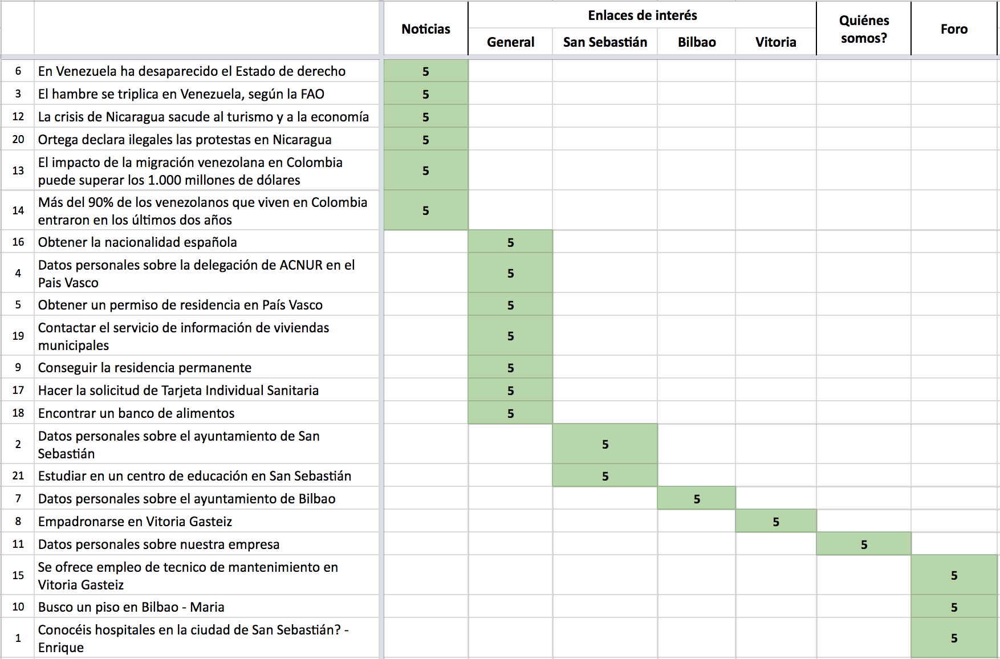
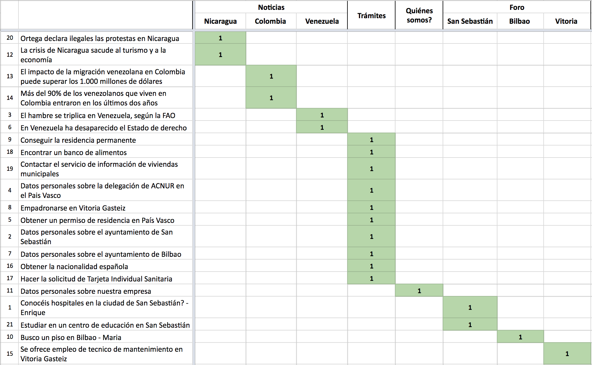
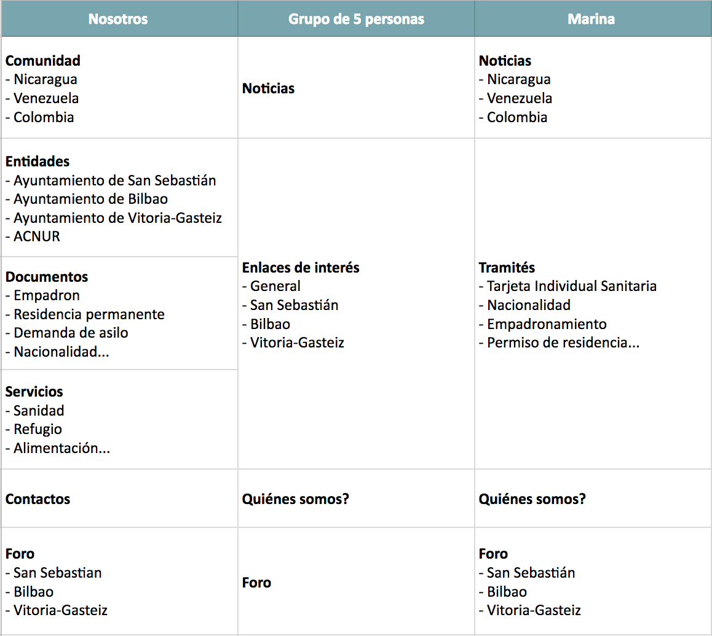
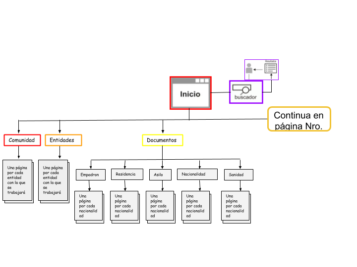
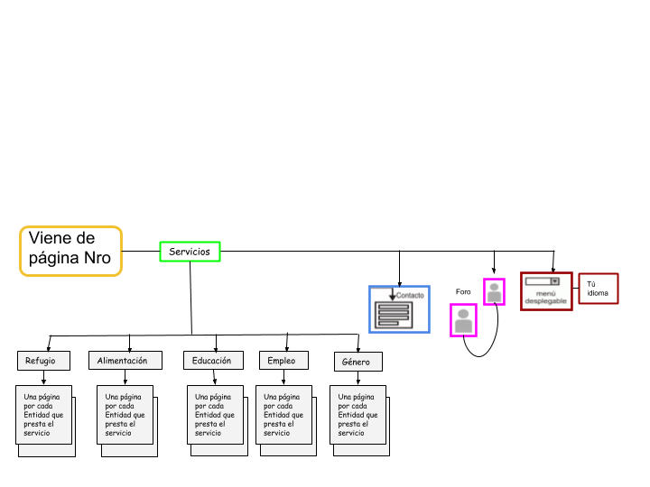

# Plano de estructura

## Introdución

## Diseño de le interacción
### Elementos del diseño de la interacción 
Desde el diseño de la interacción se busca mejorar el funcionamiento del sitio web Aupa, de este modo es importante tener en cuenta que no todos los parámetros son necesarios para el sitio, pero si deben estudiarse todos para saber cual o cuales son los más pertinentes o adecuados para el éxito de la plataforma. De este modo sabemos que los elementos del diseño interactivo son: la comunicación persona maquina, acción/reacción, flujo de trabajo, estado y los errores o mal funcionamiento. 

Las principales funciones interactivas que nos encontramos en “Aupa” son “Foro”, “Contáctenos” y “Buscar”, los cuales se ejecutarán de la siguiente manera: 

**Foro:** dentro de la pestaña foro se tendrá en cuenta la comunicación de persona maquina, acción/reacción y flujo de trabajo, todo ello mediante los siguientes pasos: 

1. La barra de menú permite acceder a la pestaña de foro. 
2. Estando allí, cada usuario podrá seleccionar la región donde quieren instalarse, es decir, San Sebastián, Bilbao, Vitoria o Irún. 
3. Las opciones serán “añadir un tema nuevo” o elegir uno ya existen con un título X ejemplo: “tramites de documentos para marruecos”.
4. Cuando el usuario esté dentro del foro elegido, tendrá la opción de leer los comentarios de los demás usuarios y así mismo responder a cada uno de ellos. Ejemplo: El personaje 1 ha dicho que para los marroquíes que llevan aproximadamente 2 años se le harán la tramitación de documentos el próximo 15 de noviembre. Por ende el personaje número 2 responde que quiere saber a dónde debe dirigirse. Pero a la hora de pulsar enter para comentar su texto la plataforma no le deja comentar. Entonces le aparecerá una nota que dice “Su mensaje no se ha enviado, vuelva a intentarlo”
5. Después de que el personaje 2 pueda responder el comentario del personaje 1 los demás personajes del foro podrán comentar el comentario del personaje 2. Así se podrá seguir la misma secuencia respondiendo los comentarios de cualquier personaje. 

**Contacto:** Desde Contacto se pretende cumplir con los siguientes elementos del diseño de la  interacción, persona-máquina y acción-reacción. 

El usuario se podrá comunicar por medio del número telefónico de las entidades o el whatsapp de las mismas. Además, cuenta con la facilidad de enviar emails a las entidades o en este caso a la plataforma de Aupa, desde el apartado contacto se le pedirá al usuario un email y en un espacio apartado podrá escribir las preguntas o inquietudes que tenga, de este modo se le enviará la respuesta al correo que asignó. 

1. Desde la barra de menú, se permite el acceso a “Contactos”
2. Una vez dentro, el usuario podrá ponerse en contacto con la página a través de la mensajería de la página.
3. Se solicitará rellenar los siguientes campos:
- Mail de contacto.
- Nombre completo (si lo desea)
- Asunto:  Motivo de contacto.
- Texto: En donde la persona podrá detallar el motivo de contacto.

4. Respecto a la acción/reacción, si el usuario busca salir sin haber antes enviado el mensaje, aparecerá una  alerta que dice “esta seguro que desea abandonar esta página”. Permitiendo al usuario decidir si seguir o no en la página actual.
5. Una vez el mensaje se envía correctamente, el sistema le dará confirmación al usuario por medio del email y otra en la pantalla de la plataforma donde dirá “Su mensaje ha sido enviado, confirme la verificación en su correo”. 

**Buscador:**
En la barra de búsqueda el usuario cuenta con la oportunidad de escribir lo que quiere consultar o la información que requiere. Ejemplo: 
1. Desplegar la barra de busqueda
2. Escribir el enunciado como “trámites para migrantes colombianos” o palabras como “migración”.
3. Clic en enter o en el icono de la lupa
4. Los resultados que le aparecerán en la pantalla a los usuarios serán conforme a las palabras que pongan en el enunciado, en este caso hablamos de resultados relacionados con las palabras “trámites” “migrantes” y “colombianos”. 

Sin embargo si nos anteponemos a posibles fallos los pasos serían los siguientes: 

1. Desplegar la barra de busqueda
2. Escribir el enunciado como “Anuncios para Italianos” 
3. Clic en enter o en el icono de la lupa
4. En caso de no haber resultados la pagina tendra un enunciado que dice “No se ha encontrado ningún resultado para “anuncios para Italianos” por favor cambie las palabras de búsqueda  para el enunciado o intentelo mas tarde”

### Elementos del diseño de la interacción 

## Arquitectura de la información (Estelle, Mégane, Lisandro)

### Estructura del contenido

#### Enfoques de arquitectura

De los distintos enfoques, el que va en sintonía con la estructura de contenido es el
de tipo jerárquica. 
Este enfoque nos muestra la apariencia del árbol, mientras los nodos principales (que en verdad son las mismas páginas) sirven de base para los nodos menores en una relación “padre/hijo”, lo importante es comprender que los niveles superiores deben guardar una estrecha relación con las necesidades del usuario.

Podemos utilizar la forma de jerarquía que se llama anchas y superficiales, es cuando los usuarios pueden acceder a cada contenido pasando por una categoría. Por ejemplo, cada categoría tiene un contenido, si hay 10 contenidos, hara 10 categorías. Es la mejor opción, y para el sitio web es la forma más adecuada porque el público objetivo hablan muchas idiomas, es mejor para ellos de usar de un enfoque simple.
Por ejemplo, en nuestra maqueta, podemos ver que en la pestaña “documento”, hay cinco categorías distintas, y necesita solo un clic para ir en cada categoría. El contenido será directamente en la pestaña, no hay otra pestaña en la categoría “Empadron” por ejemplo.

*Fuente: elaboración propia*

#### Principios de organización 

Respecto a la organización de los nodos, el sitio va a disponer en la parte superior los elementos relacionados directamente a los principales objetivos del sitio web Aupa. Estos nodos deben tener un rápido y fácil acceso para los usuarios.

Más abajo, se encuentran las páginas que les dan sentido a los nodos principales, en estos se encuentran los contenidos con la información que van a buscar los usuarios.

#### Card Sorting 

Para implementar la técnica del card sorting hemos decidido de hacer un Open Card Sorting (clasificación abierta de tarjeta) porque nuestro sitio web es nuevo y tenemos como objetivo de descubrir qué tipo de clasificación de categorías sería más correcto utilizar. En efecto, con este método los participantes obtienen tarjetas mostrando el contenido del sitio y deben clasificar las tarjetas en grupos que ellos elijan para luego describir cada grupo.

Por eso, hemos elegido distintos contenidos relevantes para hacer la prueba: 

* Datos personales sobre el ayuntamiento de San Sebastián 
* El hambre se triplica en Venezuela, según la FAO
* Datos personales sobre la delegación de ACNUR en Pais Vasco 
* Obtener un permiso de residencia en País Vasco
* En Venezuela ha desaparecido el Estado de derecho
* Datos personales sobre el ayuntamiento de Bilbao 
* Empadronarse en Vitoria Gasteiz 
* Conseguir la residencia permanente 
* Busco un piso en Bilbao - Maria 
* Conocéis hospitales en la ciudad de San Sebastián? - Enrique 
* Datos personales sobre nuestra empresa
* La crisis de Nicaragua sacude al turismo y a la economía
* Ortega declara ilegales las protestas en Nicaragua
* El impacto de la migración venezolana en Colombia puede superar los 1.000 millones de dólares
* Más del 90% de los venezolanos que viven en Colombia entraron en los últimos dos años
* Se ofrece empleo de tecnico de mantenimiento en Vitoria Gasteiz
* Obtener la nacionalidad española 
* Hacer la solicitud de Tarjeta Individual Sanitaria 
* Encontrar un banco de alimentos
* Contactar el servicio de información de viviendas municipales 
* Estudiar en un centro de educación en San Sebastián 

El contenido elegido corresponde a contenidos de nivel 2 en nuestra página web que están dentro el contenido de nivel 1. Queríamos hacer asi porque permite evaluar contenidos de mismo nivel y evitar los errores o resultados equivocados al final. Hemos también numerado cada carta para que el ejercicio sea más sencillo. 

Hicimos la prueba con un grupo de 5 personas que han reflexionado juntos sobre las categorías y han clasificado las tarjetas en ellas: 

Las cinco personas han creado las categorías siguientes: 

* Noticias 
* Enlaces de interés
  * General 
  * San Sebastián 
  * Bilbao 
  * Vitoria 
* Quiénes somos? 
* Foro

Hicimos también una segunda prueba individual con una persona que no estaba en el grupo anterior. Así, ha trabajado sola:

Marina ha creado las categorías siguientes: 
* Noticias 
  * Nicaragua 
  * Colombia
  * Venezuela 
* Tramités
  * Tarjeta Individual Sanitaria 
  * Nacionalidad
  * Empadronamiento
  * Permiso de residencia...
* Quiénes somos? 
* Foro 
  * San Sebastián 
  * Bilbao
  * Vitoria 

Ademas, podemos comparar estos resultados a las categorías que habíamos elegido antes de hacer la prueba:

Para concluir, aparecen similitudes y diferencias entre nosotros, el grupo y Marina que van a ayudarnos sobre la repartición de los contenidos en categorías. Despues observación, ya podemos decir que la categoría “Noticias” aparece más clara para los usuarios que “Comunidad” y dejaramos las subcategorías de los países. La misma cosa para la categoría “Quienes somos?”. Además, vamos a guardar la categoría “Foro” con las subcategorías. 

Lo que podemos concluir de este ejercicio muy interesante es que la prueba individual está más relevante. En efecto, con el grupo la personas tuvieron que ponerse de acuerdo sobre las categorías y la repartición de los contenidos pero así todas las opiniones no están tenidas en cuenta. Algunos pueden imponer sus opiniones a los otros entonces no vamos a saber lo que ellos piensan. Lo mejor seria de hacer la prueba con unos veinte personas de manera individual para comparar muchos resultados y llegar a una buena análisis, sin embargo, eso lleva tiempo. 

## Diagramación 
Mediante la diagramación se quiere mostrar el diseño del sitio web y para ello la estructura que se usará será la conocida como “el árbol”, además, se visualizarán las etiquetas pensadas para cada una de las pestañas por el grupo de trabajo. 

## Referencias
