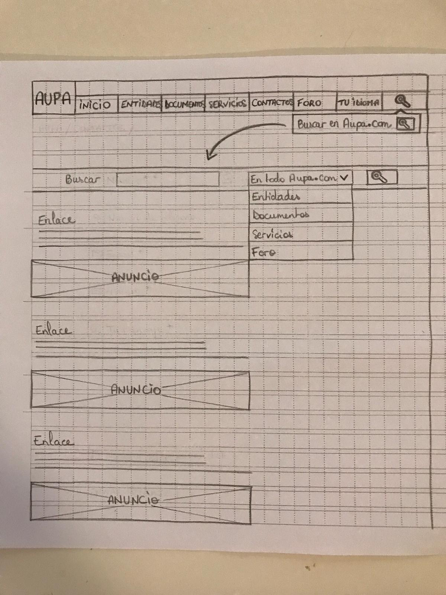
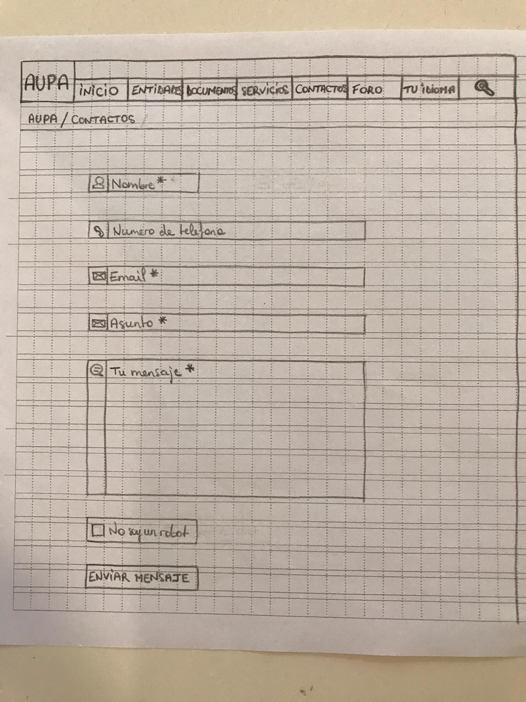

# Plano de esqueleto

## Wireframes de las páginas de Aupa

### Introducción (Lisandro)

En este documento se ha de desarrollar el plano esqueleto, para ello, primero se detectan y definen las páginas del sitio web Aupa, luego se realiza un wireframe por cada una y por último abordando cada una de las páginas con la perspectiva de los tres tipos de diseños:

- Diseño de la interfaz
- Diseño de la navegación
- Diseño de la información

A continuación se muestra el resultado de este proceso.

### Página principal (Angie)
Desde la página principal se pretende brindarle al usuario una navegación que sea intuitiva, fácil y comprensible. De este modo se ha desarrollado el plano para idealizar lo que será el sitio web de AUPA.  

### Buscador (Estelle)

### Contacto (Estelle)

### Foro 

En la segunda imagen, podemos ver la pagina principal de la pestaña “foro”. 
Para la interfaz, será una interfaz muy simple y para la navegación, será muy fácil, podremos ver los sujetos del foro, el numero de vistas y de posts serán visibles. 
En la primera, es la pagina que los usuarios podrán ver cuando van a hacer click en un sujeto. La navegación va a ser muy simple como podremos ver en la imagen.

### Páginas de similar diseño (Lisandro)
 
 Wireframe con diferentes niveles de detalle:

 - **Wireframe 1**

 

 - **Wireframe 2**

 

 - **Wireframe 3**
 
 

  **Diseño de la interfaz**

 Hay dos ejes importantes:

 *Simplicidad:* Tiene que entenderse fácilmente con un simple vistazo. Se debe contribuir en el diseño de la interfaz para que tanto los usuarios habituales como los nuevos puedan sentirse familiarizados con la página, la distribución de los elementos y las acciones que se pueden hacer de forma rápida para llegar al contenido que están buscando de la forma mas practica posible.

 *Coherencia:*  El sitio tiene un orden jerárquico en una relación padre-hijo entre las distintas páginas. Dado esto, la interfaz debe transmitir una comprensión clara de estas relaciones para aumentar la efectividad del usuario dentro de las páginas.

 Con la idea de anticipar los movimientos posibles de los usuarios dentro de un articulo, se deja en la parte superior el menú con las pestañas principales del sitio. 

 La calidad del diseño está dispuesta para mostrar una estética y diseño estándar para todos los artículos dentro de cada pestaña, esto ayuda en el proceso de familiarización con el sitio que experimenta el usuario.

  **Diseño de la navegación**

 El diseño de navegación será global, como se puede apreciar en el siguiente gráfico:

 

 Esto ofrece al usuario la posibilidad de navegar desde el artículo actual a otro punto del sitio alojado dentro de la barra de menú o volver al comienzo cliqueando en el botón de “INICIO”. Para esto es fundamental que los hipervínculos funcionan perfectamente.

 Para que el usuario sepa donde esta, la pestaña en donde se encuentra tendra una sombra para distinguirla del resto. Además, se coloca debajo del menú la ruta que ha tomado el usuario para llegar al articulo.

  **Diseño de la información**

 Para que los usuarios entiendan y usen fácilmente el sitio web, se va a ordenar la página de un artículo de forma estándar con una distribución de los elementos de información de la siguiente manera: barra de menú arriba, ruta de navegación debajo y más pequeño. Apenas debajo, en el centro el título del artículo con una letra destacada, debajo introducción, cuerpo del artículo, subtítulos, imagen/es y al final, acceso a link útiles o fuentes utilizadas.

 Para las etiquetas que de los artículos se va a utilizar indirectamente a los usuarios, haciendo un análisis de los registros de búsqueda (google analytics y trends) para conocer qué palabras claves escriben los usuarios para encontrar contenido relacionado con el tema del artículo.

