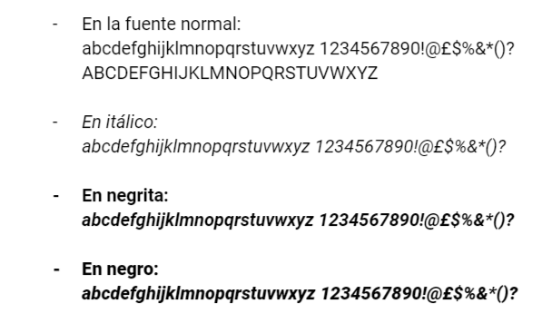
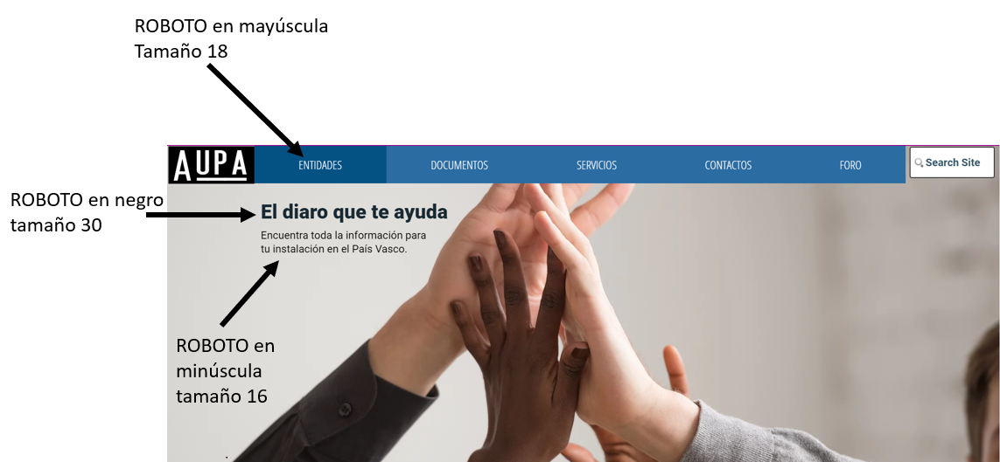

# Plano de superficie

## Introducción 

## Guía de logotipo

## Guía de color

## Guía de fuente 

La fuente es muy importante en el sitio web para la legibilidad y la accesibilidad para el que lo usa. Por eso, vamos a elegir una misma fuente para todo el sitio: 

Elegimos la fuente ROBOTO, que es una fuente sin serifa, que mejora la legibilidad del texto. Hay diferentes manera de utilizar la fuente Roboto. Vamos a utilizar estas tres maneras para nuestro sitio web porque es muy simple, práctico y legible. Entonces, aquí las diferencias:

Nos permite de crear una jerarquía : 

La fuente normal en mayúscula para los títulos de las pestañas. 
Ejemplos:  INICIÓ | COMUNIDAD | ENTIDADES | DOCUMENTOS | SERVICIOS | CONTACTOS | FORO
Para el contenido de los artículos, la fuente normal en minúscula será utilizado. 
Para el itálico, será las citas, los títulos de libros, de documentos.
En negrita, será los títulos de los artículos.
Y en negro los títulos más importantes en el sitio. 

Para el tamaño de la fuente, como podemos ver en la imagen, sera différentes segun la funcion del título: 

Los títulos de las pestañas en 18
Los títulos importantes en el sitio, es decir los grandes títulos, en 30
Los subtítulos en 16
Los contenidos en 14 

Ejemplo más concreto :

## Guía para gráficos y/o fotografías 

## Rejillas

El sitio web va a estar basado sobre el sistema de la rejilla de doce unidades. Lo que no cambiará de disposición es el logo con la barra de menú y las pestañas y también el pie de página. 

En la página de inicio el contenido estará dividido en dos columnas. 
Ejemplo:

En las páginas dedicadas a los trámites habrá combinaciones de rejillas y la publicidad ocupará una columna.
Ejemplo:

## Referencias