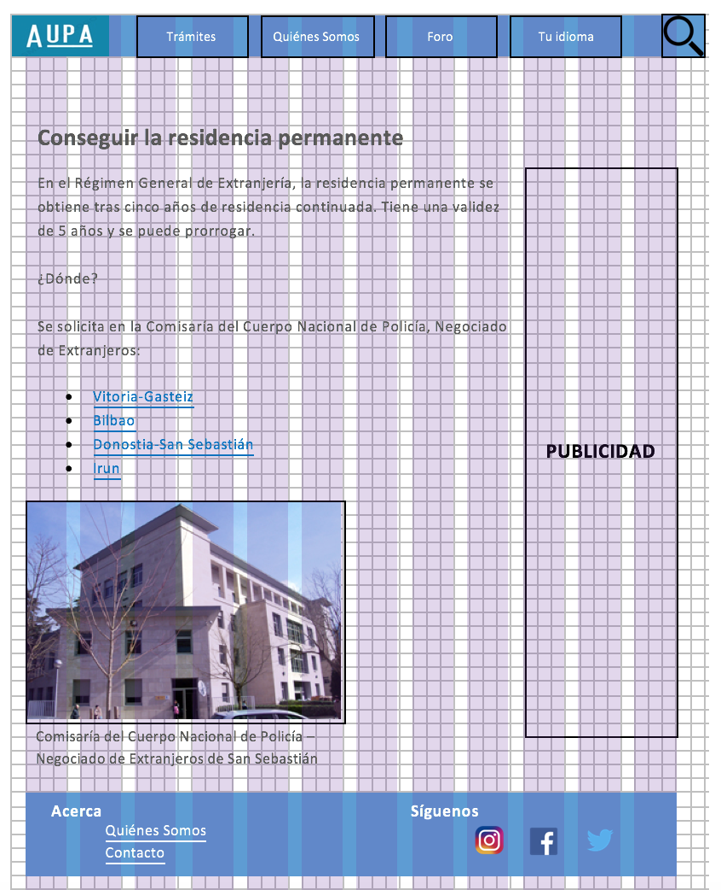

# Plano de superficie

## Introducción 

## Guía de logotipo

## Guía de color

## Guía de fuente

## Guía para gráficos y/o fotografías 

## Rejillas

El sitio web va a estar basado sobre el sistema de la rejilla de doce unidades. Lo que no cambiará de disposición es el logo con la barra de menú y las pestañas y también el pie de página. 

En la página de inicio el contenido estará dividido en dos columnas. 
Ejemplo:

En las páginas dedicadas a los trámites habrá combinaciones de rejillas y la publicidad ocupará una columna.
Ejemplo:

## Referencias